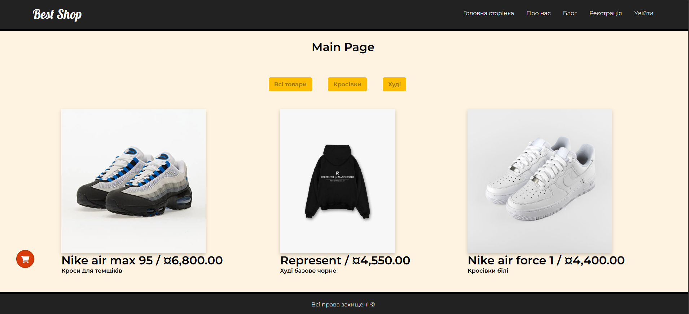
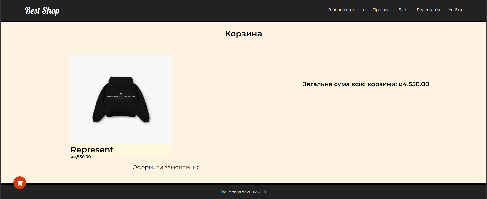
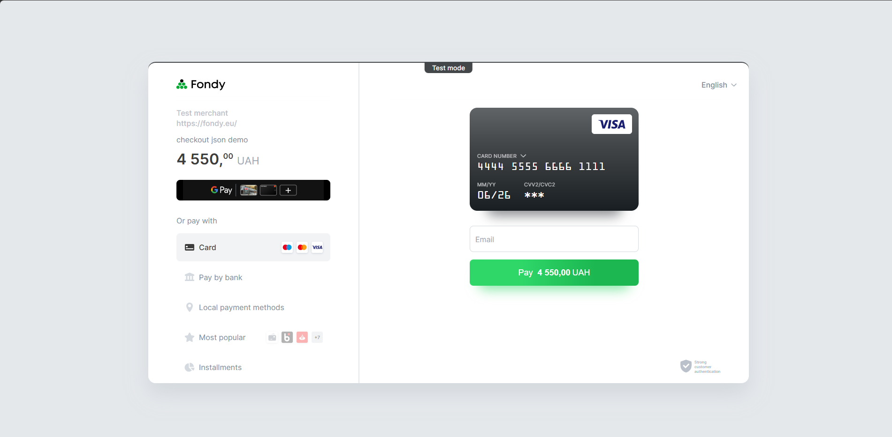

# Best Shop — ASP.NET Core MVC E-Commerce

Best Shop — це навчальний ASP.NET Core MVC застосунок, який імітує роботу простого інтернет-магазину.

Основною метою проєкту було практичне вивчення ASP.NET Core MVC, Entity Framework Core, ASP.NET Identity, роботи із сесіями, інтеграції платіжної системи Fondy та побудови серверного веб-застосунку.

Проєкт створювався як pet-проєкт для закріплення базових принципів ASP.NET Core MVC і став фундаментом перед переходом до розробки більш складних Web API застосунків.

---

# Features

- Каталог товарів
- Перегляд сторінки товару
- Фільтрація товарів за категоріями
- Shopping Cart на основі Session
- Оформлення замовлення
- Інтеграція з Fondy Checkout
- Реєстрація та авторизація користувачів
- ASP.NET Core Identity
- Валідація моделей
- Блог
- Dependency Injection

---

# Tech Stack

## Backend

- ASP.NET Core MVC
- C#
- Razor Views

## Database

- MySQL
- Entity Framework Core

## Authentication

- ASP.NET Core Identity

## Payments

- Fondy Checkout API

## Other

- Session State
- Dependency Injection
- Data Annotations Validation
- Docker
- Docker Compose

---

# Architecture

Проєкт побудований за класичною MVC архітектурою.

```
Controllers
      │
      ▼
Views (Razor)
      │
      ▼
Models
      │
      ▼
Entity Framework Core
      │
      ▼
MySQL
```

Для інтеграції платіжної системи використовується окремий сервісний шар.

```
Controllers
      │
      ▼
IPaymentService
      │
      ▼
FondyPayService
```

---

# Screenshots

## Main Page



---

## Shopping Cart



---

## Payment



---

# Running with Docker

## Clone repository

```bash
git clone https://github.com/Dimab-b/E-Commerce-Shop-ASP.NET-Core-MVC-Docker-Fondy.git

cd E-Commerce-Shop-ASP.NET-Core-MVC-Docker-Fondy
```

---

## Configure application

У файлі **appsettings.json** необхідно вказати рядок підключення до бази даних:

```json
"ConnectionStrings": {
    "DefaultConnection": "YOUR_CONNECTION_STRING"
}
```

Також потрібно вказати дані для роботи з Fondy:

```json
"PaymentSettings": {
    "MerchantId": YOUR_MERCHANT_ID,
    "SecretKey": "YOUR_SECRET_KEY"
}
```

---

## Run application

Запустіть застосунок за допомогою Docker Compose:

```bash
docker compose up --build
```

Після запуску Docker автоматично створить та запустить:

- ASP.NET Core MVC Application
- MySQL Database

---

# Fondy Payment

Для оплати використовується **Fondy Checkout API**.

Після оформлення замовлення користувач автоматично перенаправляється на сторінку оплати Fondy.

---

# Тестування оплати

Fondy не може надсилати callback-запити на **localhost**, тому для повноцінного тестування процесу оплати необхідно зробити локальний застосунок доступним через Інтернет.

Найпростіший спосіб — використати **ngrok**.

Завантажити ngrok можна за посиланням:

https://ngrok.com/download

Після встановлення запустіть тунель (замініть порт, якщо застосунок працює на іншому):

```bash
ngrok http 5000
```

Приклад результату:

```
https://1234-abcd.ngrok-free.app
```

Отриману адресу необхідно використовувати замість localhost під час тестування платіжного процесу.

---

# Project Structure

```
Controllers/
Models/
Views/
Services/
Data/
Areas/
wwwroot/
```

---

# What I Learned

Під час розробки цього проєкту я отримав практичний досвід роботи з:

- ASP.NET Core MVC
- Razor Views
- Entity Framework Core
- MySQL
- ASP.NET Identity
- CRUD операціями
- Dependency Injection
- Session Management
- Model Validation
- Інтеграцією платіжної системи
- Docker

---

# Project Status

Цей репозиторій збережений як навчальний pet-проєкт, який демонструє моє перше знайомство з ASP.NET Core MVC, Entity Framework Core, ASP.NET Identity та інтеграцією платіжної системи.

Наступні мої проєкти побудовані вже з використанням ASP.NET Core Web API, Clean Architecture, CQRS, MediatR, Redis, Hangfire, Docker та автоматизованого тестування, що відображає подальший розвиток моїх навичок у backend-розробці.
